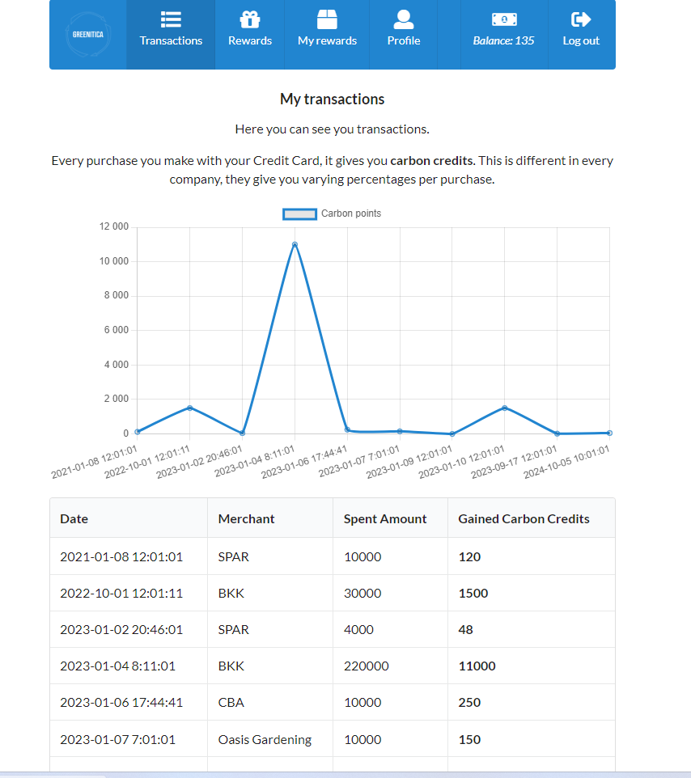

<div style="text-align:center">

<h1>Greenitica</h1>

 &nbsp;&nbsp;&nbsp;&nbsp;&nbsp;&nbsp;

</div>

## Overview

This is the repository of the SellLikeCrazy teams’ tech demo for Junction X Budapest 2023.
Our solution is a demo for a Loyalty Program application built in Laravel.




## Tested on
* Ubuntu 20.04.2.0 (Minimal install)
### Ubuntu requirements

1. Install PHP >= 8.1: https://linuxize.com/post/how-to-install-php-8-on-ubuntu-20-04/
2. Install other PHP extensions: `sudo apt install php8 php8-sqlite3 php8-xml`
3. Install Composer: `https://getcomposer.org/download/`
4. Install other tools: `sudo apt install make vim `

## Requirements

### Tools and development environment
* Any type of linux distribution
* Composer (>= 2.x)

### Software
* PHP (>= 8.0)
* Laravel (>= 10.0)

### Other
* Could be found in `composer.json`

## Installation instructions

### 1. Download/clone the files from here
```shell
git clone https://github.com/Drobesz/greenitica
```

### 2. Install composer dependencies and copy src files to src directory
```shell
composer update
composer install
```

### 4. Configure proper permissions for the `src` directory

```shell
sudo chmod -R 755 ./var/www
sudo chown -R www-data:www-data  ./var/www 
```

### 5. Run migrations
```shell
php artisan migrate:fresh && php artisan db:seed && php artisan serve
```

### 6. Visit site
Visit and see frontend at `http://localhost:8000`.
